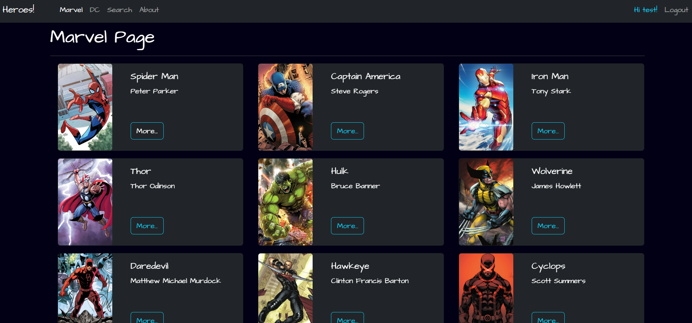

# Heroes APP (React JS)


Proyecto parte del curso de Fernando Herrera https://www.udemy.com/course/react-cero-experto

This project was bootstrapped with [Vite](https://vitejs.dev/guide/).

Conceptos practicados en este proyecto:

- React Router
- Navigate
- useMemo
- animaciones
- protección de rutas
- login
- Context
- Reducer
 

## Recursos
 
React Router 6.4.4
```
https://reactrouter.com/en/6.4.4/start/tutorial#setup
npm install react-router-dom localforage match-sorter sort-by
``` 

Query String
```
npm install query-string
```
